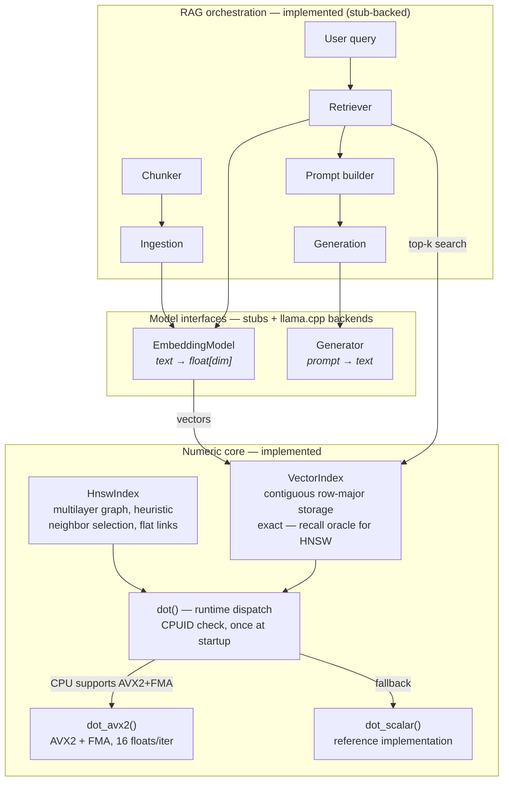
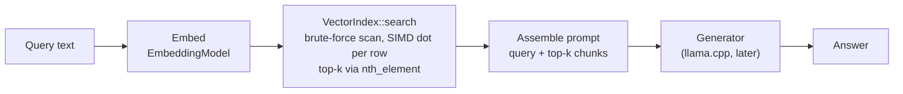

# vecdb — a hand-rolled vector search engine (with a RAG demo on top)

[](https://github.com/ctj01/rag-system-cpp/actions/workflows/ci.yml)

A vector similarity search engine written from scratch in **C++20**, with a
local RAG (Retrieval-Augmented Generation) pipeline built on top as a demo.
Everything runs locally — no external APIs.

The point of this project is the **numeric core**: contiguous cache-friendly
storage, a hand-written AVX2 SIMD kernel with runtime CPU dispatch, and
(eventually) an HNSW index — not the plumbing around it. Model inference
(embeddings, generation) sits behind minimal interfaces and will be backed by
`llama.cpp`.

## Architecture



### Ingestion flow (planned)


### Query flow



The full pipeline runs today: retrieval is real (HNSW over the hash-embedder
stub), and the generator stub echoes the assembled prompt — making the
evidence and instructions a real LLM would receive fully inspectable. Try it:
`./build/apps/rag_demo how does the kalman filter estimate the hedge ratio`.

## Design decisions

**One contiguous buffer, row-major.** All vectors live in a single
`std::vector<float>` with stride `dim` — not a list of per-vector arrays.
Brute-force search is memory-bandwidth bound, so the scan must read physically
sequential memory: the CPU prefetcher streams cache lines ahead of the loop
and the SIMD kernel loads 8 adjacent floats per instruction. The layout *is*
the optimization.

**Normalize on insert.** Vectors are L2-normalized once, when added. Cosine
similarity at query time then reduces to a bare dot product — no divisions or
square roots in the hot path.

**SIMD isolated in one translation unit.** Only `dot_avx2.cpp` is compiled
with `-mavx2 -mfma`. Applied globally, the compiler could emit AVX2 anywhere
in the binary and crash (SIGILL) on older CPUs regardless of dispatch logic.
`dot()` queries CPUID once at startup and routes to the AVX2 kernel or the
scalar fallback. This is the same pattern serious BLAS libraries use.

**Two accumulators in the SIMD kernel.** FMA has ~4 cycles of latency; with a
single accumulator each `fmadd` waits on the previous one. Two independent
chains keep the pipeline fed (~2x throughput on the main loop).

**Tolerance-based testing.** SIMD and scalar results are legitimately not
bit-identical: float addition is not associative (different summation order)
and FMA rounds once per multiply-add instead of twice. Tests compare both
implementations against a double-precision reference with a relative
tolerance, across sizes that exercise every kernel path (tail-only, one
8-block, full 16-wide body, real embedding dims like 384/768/1536).

**Top-k selection via `nth_element`.** Average O(n) quickselect puts the k
best results in the prefix without sorting the rest; only those k get sorted.
For large n and small k this beats a full O(n log n) sort.

## Project layout

```
rag-system/
├── CMakeLists.txt            # C++20 strict, Release default, high warnings
├── src/
│   ├── CMakeLists.txt        # vecdb_core static lib; -mavx2 only on dot_avx2.cpp
│   ├── core/
│       ├── dot.hpp           # kernel contract: scalar / avx2 / dispatch
│       ├── dot_scalar.cpp    # reference implementation (ground truth)
│       ├── dot_avx2.cpp      # AVX2+FMA kernel — the only TU built with -mavx2
│       ├── dot_dispatch.cpp  # CPUID feature detection, cached at startup
│       ├── vector_index.hpp  # brute-force index over contiguous storage
│       ├── vector_index.cpp
│       ├── hnsw_index.hpp    # HNSW: multilayer graph, flat adjacency
│       └── hnsw_index.cpp
│   ├── models/
│   │   ├── embedding_model.hpp  # abstract interface + factory
│   │   ├── generator.hpp        # abstract interface + factory
│   │   ├── stub_models.cpp      # HashEmbedder (feature hashing), EchoGenerator
│   │   └── llama_models.hpp/.cpp# llama.cpp GGUF backends (RAII over the C API)
│   └── rag/
│       ├── chunker.hpp/.cpp     # word-window chunking with overlap
│       └── rag_pipeline.hpp/.cpp# chunk → embed → retrieve → prompt → generate
├── apps/
│   └── rag_demo.cpp          # interactive demo over a built-in corpus
├── bench/
│   ├── CMakeLists.txt
│   └── bench_dot.cpp         # kernel + scan benchmarks, cache-level sweep
└── tests/
    ├── CMakeLists.txt
    ├── test_framework.hpp    # minimal zero-dependency harness
    ├── test_dot.cpp          # SIMD ≡ scalar on random vectors, vs double ref
    ├── test_index.cpp        # normalization, top-k vs naive, validation
    ├── test_hnsw.cpp         # recall vs oracle, determinism, self-retrieval
    ├── test_models.cpp       # stub embedder/generator, end-to-end retrieval
    └── test_rag.cpp          # chunker windows/overlap, pipeline end-to-end
```

## Benchmarks

Measured on an AMD Ryzen 9 9900X3D (Zen 5, WSL2 Ubuntu 24.04, GCC 13, `-O3`),
median of 7 samples via `build/bench/vecdb_bench`. The scalar loop is
genuinely scalar: GCC will not auto-vectorize a float reduction at `-O3`
(reordering changes the result; only `-ffast-math` allows it).

**Single dot product, data hot in cache** (pure compute throughput):

| dim  | scalar | AVX2   | speedup |
|------|--------|--------|---------|
| 384  | 119.5 ns | 11.5 ns | 10.4x |
| 768  | 260.1 ns | 20.9 ns | 12.4x |
| 1536 | 545.4 ns | 52.3 ns | 10.4x |

Speedup exceeds the naive 8x (8 lanes) because FMA fuses multiply+add into
one instruction and two accumulator chains keep both FMA ports busy, while
the scalar version is a single serial dependency chain.

**Full scan, one dot per row (dim=768)** — the brute-force search hot loop
at working-set sizes targeting L2, L3 and RAM:

| working set | rows | size | scalar ns/vec | AVX2 ns/vec | speedup | AVX2 GB/s |
|-------------|------|------|---------------|-------------|---------|-----------|
| L2-resident  | 512    | 1.5 MB  | 264.6 | 27.4 | 9.7x | 112.3 |
| L3-resident  | 8,192  | 24 MB   | 263.0 | 29.7 | 8.8x | 103.3 |
| RAM-resident | 65,536 | 192 MB  | 266.5 | 59.3 | 4.5x | 51.8  |

The collapse in the last row is the point: once the index outgrows the caches
the AVX2 kernel sits idle waiting for DRAM (~52 GB/s single-core effective
bandwidth here) and the speedup halves. The scalar version is so slow it
never hits the bandwidth ceiling (~11.5 GB/s at every size — always
compute-bound). Making the ALU faster no longer helps at scale; **touching
less memory does** — that is the quantitative case for HNSW, delivered below.

**HNSW vs exact search** (n=100k, dim=768, clustered corpus — 256 Gaussian
clusters, the regime real text embeddings live in; recall measured against
the exact brute-force top-10 over 100 queries; `build/bench/vecdb_bench_hnsw`):

Exact brute-force baseline: **6,990 µs/query**. Build: heuristic selection
33.3s (3,005 inserts/s), simple selection 14.7s.

| efSearch | heuristic recall@10 | µs/query | simple recall@10 | µs/query |
|----------|--------------------:|---------:|-----------------:|---------:|
| 10   | 0.779 | 59  | 0.630 | 44  |
| 20   | 0.908 | 61  | 0.734 | 66  |
| 50   | 0.997 | 88  | 0.876 | 96  |
| 100  | 1.000 | 117 | 0.907 | 116 |
| 200  | 1.000 | 161 | 0.920 | 144 |
| 400  | 1.000 | 257 | 0.951 | 224 |

Two findings worth reading twice:

- **~60-80x over exact search at full recall.** At efSearch=50 the heuristic
  graph returns 99.7% of the true top-10 in 88 µs vs 6,990 µs exact; at
  efSearch=100 recall is 1.000 within measurement resolution.
**Parallel build & search** (same corpus; 9900X3D, 12 cores / 24 threads):

- Batch build with striped per-node locks: **33.3s → 5.3s (6.3x)** at 24
  threads (18,789 inserts/s), with recall@10 = 0.999 at ef=100 — quality
  preserved. A 256-node sequential warmup seeds the scaffold first: with a
  tiny graph, concurrent inserters cannot see each other (a node becomes
  visible only when its reverse edges land), which measurably
  under-connects the earliest nodes if built in parallel from the start.
- Search on the frozen graph is lock-free: **7,859 → 41,526 queries/s**
  (1 → 24 threads). Sub-linear scaling is expected — all threads share the
  same memory bandwidth to the vector data.

- **The neighbor-selection heuristic is not optional.** Naive "M closest"
  selection plateaus at 0.91-0.95 recall *no matter how much efSearch you
  throw at it* — at ef=400 it still trails ef=50 with the heuristic. This is
  the topological failure predicted at design time: naive selection spends
  every edge inside the local cluster, clusters lose their bridges, and no
  beam width buys connectivity back. The heuristic costs 2.3x at build time
  (re-pruning), once; naive selection pays in recall forever.

**War story — the O(n²) reserve.** The first run of this benchmark spent 14+
minutes inside the *brute-force oracle build* (which should take seconds).
Diagnosis from outside: RSS frozen at ~560 MB while CPU sat at 100% — the
process was moving bytes, not making progress. Root cause: `add()` called
`data_.reserve(size + dim)` per insert to "avoid mid-insert reallocation".
An explicit `reserve` allocates **exactly** the requested capacity, silently
defeating `std::vector`'s geometric growth — every insert reallocated and
copied the entire buffer: ~15 TB of memcpy across 100k inserts. Removing the
line took the oracle build from 14+ minutes to seconds. Lesson: `reserve` is
for when you know the *final* size; per-insert "help" is an anti-optimization.

## Build & test

Requires a C++20 compiler (GCC 13+ / Clang 16+) and CMake ≥ 3.20. Developed
on WSL2 (Ubuntu 24.04).

```bash
cmake -B build -S . -DCMAKE_BUILD_TYPE=Release
cmake --build build -j
ctest --test-dir build --output-on-failure
```

The AVX2 kernel is always compiled, but only executed if the CPU reports
AVX2 + FMA at runtime; otherwise the scalar path runs.

## Real models (llama.cpp)

The build fetches and compiles [llama.cpp](https://github.com/ggml-org/llama.cpp)
(pinned tag, CPU backend) unless configured with `-DVECDB_WITH_LLAMA=OFF`.
The llama backends implement the same `EmbeddingModel` / `Generator`
interfaces as the stubs — the pipeline code is identical either way.

Download small GGUF models (~500 MB total; any embedding/instruct GGUF works):

```bash
mkdir -p models && cd models
curl -sL -o minilm-l6-v2.f16.gguf \
  https://huggingface.co/second-state/All-MiniLM-L6-v2-Embedding-GGUF/resolve/main/all-MiniLM-L6-v2-ggml-model-f16.gguf
curl -sL -o qwen2.5-0.5b-instruct-q4_k_m.gguf \
  https://huggingface.co/Qwen/Qwen2.5-0.5B-Instruct-GGUF/resolve/main/qwen2.5-0.5b-instruct-q4_k_m.gguf
```

Then run the demo with real local inference:

```bash
./build/apps/rag_demo \
  --embed-model models/minilm-l6-v2.f16.gguf \
  --gen-model models/qwen2.5-0.5b-instruct-q4_k_m.gguf \
  how does the kalman filter estimate the hedge ratio
```

Without the flags the demo runs on the deterministic stubs (no downloads
needed) and the "answer" echoes the assembled prompt for inspection.

## Roadmap

- [x] CMake skeleton (C++20, warnings, Release default)
- [x] Contiguous-storage brute-force index with cosine similarity
- [x] AVX2+FMA dot product kernel with scalar fallback and runtime dispatch
- [x] Equivalence tests (SIMD ≡ scalar ≡ double reference)
- [x] Micro-benchmark: scalar vs AVX2 throughput, memory-bandwidth ceiling
- [x] `EmbeddingModel` / `Generator` interfaces with deterministic stubs
      (signed feature hashing with splitmix64 finalizer / prompt echo)
- [x] RAG orchestration: word-window chunking with overlap → embed → HNSW
      retrieval → grounded prompt assembly (numbered passages, source
      attribution) → generate; interactive demo in `apps/rag_demo`
- [x] `llama.cpp` integration behind the model interfaces (pinned tag via
      FetchContent, optional `-DVECDB_WITH_LLAMA=OFF`): GGUF embeddings with
      mean pooling, greedy/temperature generation, RAII over the C API
- [x] HNSW index — heuristic neighbor selection (simple behind a flag),
      flat adjacency arrays, epoch-stamped visited pool, neighbor prefetch;
      recall@10 = 1.00 at 60x over exact search (n=100k, dim=768, ef=100)
- [x] Concurrency phase 2: parallel batch build (striped per-node mutexes,
      atomic work dispenser, stateless per-id levels, sequential warmup) —
      6.3x build speedup at recall 0.999; lock-free searches scale to
      41.5k queries/s on 24 threads
- [x] HNSW benchmark: recall/latency curve over efSearch, heuristic vs
      simple selection at scale
- [x] Persistence: binary save/load of the full HNSW state (config, vectors,
      graph) — loaded indexes return bit-identical search results
- [x] Generator quality: repeat penalty + the model's chat template (instruct
      models answer concisely inside their template; raw completion prompts
      made small models ramble)

## Notes for readers coming from C#

The codebase is annotated with greppable `// [C#→C++]` comments explaining
where C++ behaves differently from .NET (RAII vs `using`/`Dispose`,
`std::span` vs `ReadOnlySpan<T>` without a GC keeping buffers alive, move
semantics/RVO on return, headers vs assemblies, `explicit` constructors...):

```bash
grep -rn "C#→C++" src/ tests/
```
